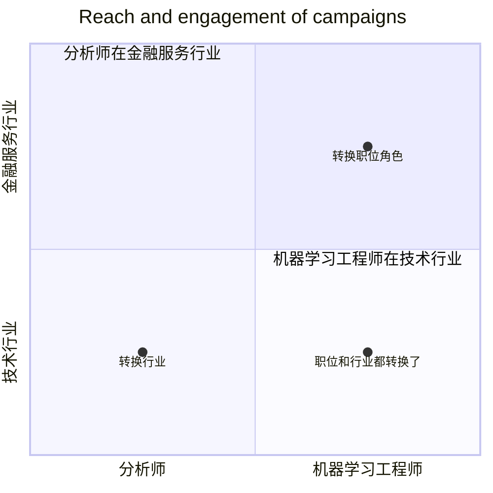

# 第 7 章：开启 AI 求职之旅的简单框架

找工作有几个可预测的步骤，包括选择你想申请的公司、准备面试，最后选择职位并协商薪资和福利。在本章中，我想关注一个对许多 AI 求职者有用的框架，特别是那些从不同领域进入 AI 领域的人。

如果你正在考虑下一份工作，问问自己：

✓ **你是否在转换职位角色？** 例如，如果你是一名软件工程师、大学生或物理学家，想成为一名机器学习工程师，那就是职位转换。
✓ **你是否在转换行业？** 例如，如果你在医疗保健公司、金融服务公司或政府机构工作，想转到软件公司工作，那就是行业转换。

## 求职

一家科技初创公司的产品经理成为同一家公司（或另一家公司）的数据科学家，是职位转换。一家制造公司的营销人员成为一家科技公司的营销人员，是行业转换。一家金融服务公司的分析师成为一家科技公司的机器学习工程师，则是职位和行业都转换了。

如果你是第一次在 AI 领域找工作，你可能会发现转换职位或转换行业比同时进行两者更容易。假设你就是那位在金融服务行业工作的分析师：

✓ 如果你在金融服务行业找到一份数据科学或机器学习的工作，你就可以在获得 AI 知识和专业知识的同时，继续利用你特定领域的知识。在这个职位上工作一段时间后，你将更有条件转向科技公司（如果这仍然是你的目标）。
✓ 或者，如果你成为一家科技公司的分析师，你可以继续运用你作为分析师的技能，但将其应用于不同的行业。成为科技公司的一员也让你更容易从同事那里了解 AI 的实际挑战、在 AI 领域取得成功的关键技能等。

如果你考虑转换职位，初创公司可能比大公司更容易做到这一点。虽然有例外，但初创公司通常没有足够的人手来完成所有期望的工作。如果你能帮助处理 AI 任务——即使这不是你的正式工作——你的工作很可能会受到赞赏。这为可能的职位转换奠定了基础，而无需离开公司。相比之下，在大公司，僵化的奖励体系更可能奖励你做好本职工作（以及你的经理支持你完成你被雇佣来做的工作），但不太可能奖励你职责范围之外的贡献。

在你期望的职位和行业（例如，科技公司的机器学习工程师）工作一段时间后，你会对该行业该职位更高级别的要求有很好的认识。你也会在该行业内拥有一个可以帮助你的人脉网络。因此，未来的求职——如果你选择坚持该职位和行业——可能会更容易。

换工作时，你正在踏入未知领域，特别是当你转换职位或行业时。熟悉新职位和/或行业最未被充分利用的工具之一是信息访谈。我将在下一章分享更多相关内容。

感谢 Salwa Nur Muhammad（DeepLearning.AI 附属机构 FourthBrain 的 CEO）提供了本章节的一些观点。

## 克服不确定性 (Overcoming Uncertainty)

关于未来，我们有很多不知道的事情：我们何时能治愈阿尔茨海默病？谁将赢得下次选举？或者，在商业背景下，明年我们会有多少客户？

世界上发生着如此多的变化，许多人对未来感到焦虑，尤其是在找工作时。我有一个帮助我重获掌控感的实践方法。面对不确定性时，我尝试：

1.  **列出可能的场景，** 承认我不知道哪一个会发生。
2.  **为每个场景制定行动计划。**
3.  **开始执行看起来合理的行动。**
4.  **随着未来逐渐清晰，定期回顾场景和计划。**

例如，在 2020 年 3 月的新冠肺炎 (Covid-19) 大流行期间，我做了这个情景规划练习。我设想了从 Covid-19 中快速（三个月）、中等（一年）和缓慢（两年）恢复的情景，并制定了管理每种情况的计划。这些计划帮助我确定了优先事项。

同样的方法也适用于个人生活。如果你不确定是否能通过考试、获得工作录用通知或被批准签证——所有这些都可能带来压力——你可以写下在每种可能情况下你会怎么做。思考各种可能性并执行计划可以帮助你无论未来带来什么都能有效地应对。

**额外提示：** 通过接受 AI 和统计学的培训，你可以为每个情景计算一个概率。我是“超级预测”(Superforecasting) 方法的粉丝，该方法综合了许多专家的判断来形成概率估计。
